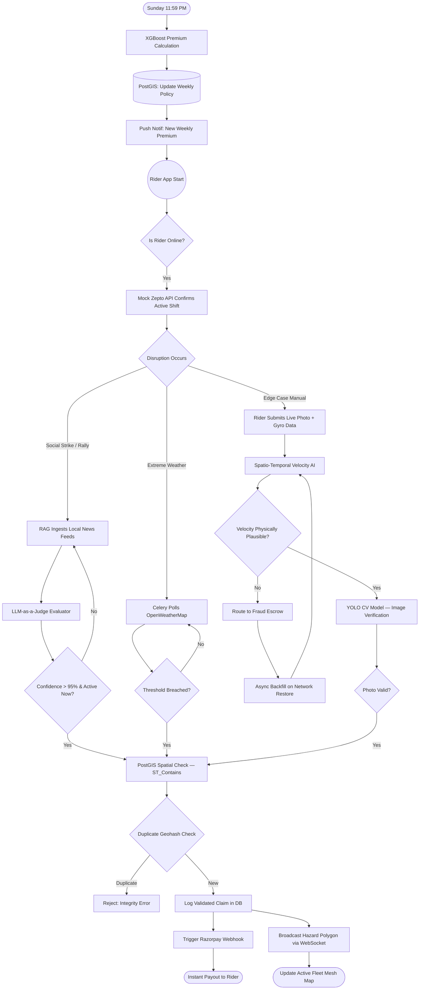

# 🛡️ Insure-Partner
### *Zero-Touch Parametric Income Protection for Q-Commerce Delivery Partners*

> **Guidewire DEVTrails 2026 — Phase 1 Submission**

[](https://flutter.dev)
[](https://fastapi.tiangolo.com)
[](https://postgis.net)
[](https://xgboost.readthedocs.io)
[](https://redis.io)

---

## 📌 1. Executive Summary

**Insure-Partner** is an event-driven, parametric insurance mobile platform designed exclusively for **Q-Commerce delivery partners** (Zepto, Swiggy Instamart, Blinkit). It provides **zero-touch income protection** against external, uncontrollable disruptions — without a single manual claim.

### The Problem We Solve

Q-Commerce workers operate within hyper-local **2–3 km delivery radiuses**. When a localized disruption strikes — a flooded underpass, a fallen tree, or a sudden neighborhood strike — these riders are **completely locked out of earning**. Since they are paid per delivery, even a few disrupted hours can wipe out an entire day's wages.

Unlike salaried employees, gig workers have **no financial safety net** for events they cannot control.

### Our Solution

| Dimension | Detail |
|---|---|
| **Coverage** | Loss of Daily Income **only** (excludes health, life, accident, vehicle) |
| **Trigger Method** | Fully Parametric — Zero manual claims |
| **Target Users** | Q-Commerce Delivery Partners |
| **Payout Speed** | Instant (Razorpay Sandbox) |
| **Fraud Defense** | Spatio-Temporal Trajectory AI + Hardware Sensor Fusion |

---

## 📱 2. Platform Choice — Why Native Mobile (Flutter)?

We explicitly chose a **Native Flutter/Dart Mobile Application** over a Web App for three critical, non-negotiable reasons:

### 🚀 Zero-Friction Onboarding
Gig workers need minimal barriers to entry. Onboarding requires only:
- OTP mobile verification
- Linking their Platform Worker ID (e.g., Zepto Partner ID)

No complex document uploads. No manual policy drafting. The backend AI autonomously handles zone risk profiling.

### 📡 Deep Hardware Telemetry (Anti-Spoofing)
Web browsers **cannot reliably** provide background Z-axis (altitude) and raw gyroscope data. This is critical to defeating advanced GPS spoofing syndicates. Native Flutter isolates allow deep **Accelerometer + Gyroscope sensor fusion** — making our anti-fraud engine significantly harder to defeat than any web-based competitor.

### 📶 Offline-First Resilience
Q-commerce riders in heavy storms experience severe 4G packet loss. A native app allows us to:
- Securely cache claim payloads locally (SQLite/Hive)
- Asynchronously backfill telemetry when the network stabilizes
- Ensure no legitimate claim is ever lost due to connectivity

---

## 💳 3. Financial Model — Weekly Parametric Pricing

### Why Weekly?

Gig workers operate on a **week-to-week earning and payout cycle**. Our premium model aligns with their cash flow — not arbitrary monthly billing cycles.

### How It Works

Every **Sunday at 11:59 PM**, a background **Celery job** automatically calculates the rider's premium for the upcoming 7 days using our **XGBoost pricing model**:

```
Weekly Premium = Base Rate × 7-Day Weather Risk Score × Zone Historical Risk Score
```

| Factor | Source |
|---|---|
| Base Rate | Platform-defined floor rate |
| Weather Risk Score | OpenWeatherMap 7-day forecast |
| Zone Historical Risk Score | PostGIS historical claim density per geohash |

The rider receives a **push notification** confirming their coverage before the new week begins — no surprises, no hidden charges.

---

## ⚡ 4. Parametric Trigger System — Dual-Layer Architecture

Insure-Partner uses a **three-tier trigger system** to cover every type of disruption:

### Tier 1 — Primary Macro Trigger (RAG-Powered Social Detection)

Standard APIs cannot detect social events like strikes or rallies. Our **RAG (Retrieval-Augmented Generation) pipeline** continuously ingests:
- Local news RSS feeds
- Municipal public notice feeds
- Social media signals

An **LLM-as-a-Judge agent** evaluates each event against a strict JSON schema. A payout is triggered **only** if:
- Strike/disruption is **confirmed active** (not historical or speculative)
- Confidence score exceeds **95%**
- The rider's geohash is **spatially contained** within the disruption zone (PostGIS `ST_Contains`)

### Tier 2 — Secondary Macro Trigger (Deterministic Environmental)

Event-driven Celery polling of **OpenWeatherMap** and **Traffic APIs**. Triggers automatically when measurable thresholds are breached:

| Parameter | Threshold |
|---|---|
| Rainfall Intensity | > 50 mm/hr |
| Wind Speed | > 60 km/h |
| Traffic Disruption Index | Platform-configurable |

### Tier 3 — Micro Trigger (Edge-Case Manual Camera Claim)

For unmapped, real-world disruptions (fallen tree, road cave-in), the rider uses our **Instant Claim Camera**:
1. Rider captures a **live photo** of the obstruction
2. A lightweight **YOLO computer vision model** validates the physical presence of the disruption
3. Native gyroscope and accelerometer data is packaged alongside the image for anti-spoofing validation

---

## 🤖 5. AI/ML Integration — Full Stack

Insure-Partner integrates AI at every layer of the pipeline, not just as a marketing feature.

### 5a. XGBoost — Dynamic Premium Pricing Engine
- **Input features:** Historical zone risk (PostGIS claim density), 7-day weather forecast, weekly delivery volume, time-of-year seasonality
- **Output:** Personalized weekly premium per rider
- **Training data:** Simulated historical claim datasets + OpenWeatherMap historical records
- Runs every Sunday night via Celery task queue

### 5b. LLM-as-a-Judge — RAG Strike Detection Agent
- **Framework:** FastAPI + RAG pipeline (FAISS / pgvector)
- **Role:** Evaluates whether a news/social event constitutes a validated, active, hyperlocal disruption
- **Output schema:** Strict JSON `{ event_type, confidence_score, geohash, active_now }` — no free-form hallucination
- **Threshold enforcement:** Only `confidence_score > 0.95` with `active_now: true` fires a claim event

### 5c. XGBoost Isolation Forest — Velocity Anomaly / Fraud Detection
- **Input:** GPS trajectory deltas, Accelerometer vectors, Gyroscope readings, IP geolocation
- **Detection method:** Calculates physical velocity between the rider's last authenticated ping and the claim ping
- **Flags:** Mathematically perfect straight-line movement ("teleportation"), speed physically impossible for a human on a bike, stationary gyroscope contradicting claimed motion
- **Action:** Flagged claims are routed to **Escrow state**, not denied outright

### 5d. YOLO CV Model — Image Disruption Verification
- **Model:** Lightweight YOLO variant optimized for mobile edge inference
- **Purpose:** Verifies the physical presence of a claimed obstruction in the submitted photo
- **Hardening:** Validates the image is a live camera capture (not a screenshot or replay)

---

## 🗺️ 6. Crowdsourced Disruption Mesh — Protecting the Active Fleet

Insure-Partner doesn't just process claims; it **actively protects other riders in real-time**.

When an edge-case claim (e.g., fallen tree) is validated by the CV model and confirmed by PostGIS:

```
Claim Validated
      ↓
PostgreSQL writes a "Hazard Polygon" at the geohash coordinate
      ↓
FastAPI broadcasts a WebSocket push to all active Flutter clients within 3km
      ↓
Rider maps instantly render a warning pin
      ↓
Cascading identical claims are prevented + riders are rerouted safely
```

This creates a **self-reinforcing safety network** — each validated claim makes the platform smarter and safer for every other rider.

---

## 🚨 7. Adversarial Defense — Anti-Spoofing Architecture

### The Threat Model

GPS spoofing syndicates — groups of fraudulent actors who fake their location to trigger mass false payouts — represent an existential risk to any parametric insurance platform. We treat fraud defense as a **first-class engineering concern**, not an afterthought.

### The Defense: Spatio-Temporal Trajectory AI

Instead of validating a **single GPS ping**, our FastAPI backend analyses the rider's **complete movement trajectory**:

| Check | Method |
|---|---|
| Velocity anomaly | XGBoost Isolation Forest on GPS delta vs. time |
| Physical plausibility | Gyroscope + Accelerometer vs. claimed GPS speed |
| Network origin | IP Geolocation vs. GPS coordinates (VPN detection) |
| Trajectory continuity | Movement path must show a logical struggle out of the disruption zone |

### The UX Balance — Escrow State (Not Denial)

Severe weather causes genuine GPS signal bouncing. We **never arbitrarily deny a flagged claim**. Instead:

1. The payout is moved to an **Escrow/Pending state**
2. The Flutter app caches the missing telemetry breadcrumbs locally (Hive/SQLite)
3. When the rider reconnects to stable Wi-Fi, the app **asynchronously backfills** the complete trajectory
4. If the trajectory confirms a logical path out of the danger zone, the rules engine **auto-releases** the escrowed funds

This ensures that **honest riders in genuinely bad conditions are never penalized** for signal loss.

---

## 👥 8. Persona-Based Scenarios

### Scenario 1: Macro Social Disruption (RAG-Detected Strike)

> *"Arjun is mid-shift in Koramangala when a transport union strike breaks out without warning."*

1. Our RAG engine ingests local Kannada-language news feeds within minutes
2. LLM evaluator confirms: `{ confidence: 0.97, active_now: true, event_type: "transport_strike" }`
3. System auto-pauses Arjun's active Zepto shift (via Mock Platform API)
4. Remaining shift hours are calculated; instant payout is triggered via Razorpay
5. **Arjun receives his income without filing a single form**

### Scenario 2: Edge-Case + Adversarial Spoofing Attack

> *"A massive tree falls on Indiranagar 100 Feet Road. Simultaneously, a syndicate member at home attempts to spoof their GPS to the same location."*

| Actor | System Response |
|---|---|
| **Genuine Rider** | Submits live photo + native telemetry. Velocity trajectory is valid. CV model confirms tree. Payout processed. |
| **Spoofing Actor** | Velocity check detects teleportation (0→claim location in 0 seconds). Gyroscope shows phone is flat/stationary. Claim routed to fraud escrow and locked. |

**Outcome:** PostGIS writes a deduplication `geohash` entry, preventing any subsequent duplicate claims for the same obstruction.

---

## 🔄 9. System Workflow



---

## ⚙️ 10. Tech Stack

| Layer | Technology | Justification |
|---|---|---|
| **Mobile Frontend** | Flutter (Dart) | Native Isolates for background sensor fusion; 60fps WebSocket map rendering; offline-first SQLite/Hive storage |
| **Backend API** | Python + FastAPI | Async-first, high-throughput; ideal for event-driven WebSocket broadcasting |
| **Task Queue** | Celery + Redis | Reliable scheduled jobs (Sunday pricing), async backfill, API polling workers |
| **Database** | PostgreSQL + PostGIS | `ST_Contains` spatial queries for geohash validation and hazard polygon storage |
| **ML Models** | XGBoost, YOLO (CV) | XGBoost for pricing + fraud isolation; YOLO for lightweight edge-deployable image verification |
| **RAG Pipeline** | FastAPI + pgvector / FAISS | Retrieval-augmented generation for local news ingestion and LLM strike detection |
| **Payments** | Razorpay Sandbox | Simulated instant payout webhooks for demo |
| **External APIs** | OpenWeatherMap, Google Routes API, Zepto Mock API | Weather triggers, traffic data, platform shift status |

---

## 🗓️ 11. Development Roadmap

### Phase 1 — Foundation (Current Submission)
- [x] System architecture design and workflow documentation
- [x] Parametric trigger logic definition (RAG, Deterministic, CV)
- [x] Anti-spoofing architecture design (Velocity AI + Sensor Fusion)
- [x] Weekly XGBoost pricing model design
- [x] Crowdsourced disruption mesh design

### Phase 2 — Core Build
- [ ] Flutter app: OTP onboarding, live map, claim camera, WebSocket hazard mesh
- [ ] FastAPI backend: Celery workers, RAG ingestion pipeline, WebSocket broadcaster
- [ ] PostGIS schema: Geohash tables, Hazard Polygons, Policy records
- [ ] XGBoost model: Training on synthetic historical data, Sunday pricing job

### Phase 3 — AI Integration & Hardening
- [ ] LLM-as-a-Judge integration with strict JSON schema enforcement
- [ ] YOLO CV model integration and mobile optimization
- [ ] Spatio-Temporal Trajectory AI (Velocity Anomaly + Sensor Fusion)
- [ ] Razorpay Sandbox integration and Escrow state machine

### Phase 4 — Demo & Pilot Readiness
- [ ] End-to-end scenario walkthroughs (Scenarios 1 & 2)
- [ ] Simulated fleet mesh demo (WebSocket hazard broadcast)
- [ ] Anti-spoofing red-team test (legitimate vs. spoofed claim comparison)
- [ ] Onboarding flow UX polish

---

## 🎯 12. Why Insure-Partner Wins

| Evaluation Dimension | Our Approach |
|---|---|
| **Innovation** | First parametric insurance platform using hardware sensor fusion + trajectory AI for fraud defense |
| **Real-World Relevance** | Directly addresses income volatility for 10M+ Indian gig workers |
| **AI Depth** | AI at every layer: pricing, strike detection, fraud isolation, image verification |
| **Technical Architecture** | Event-driven, spatial, offline-first — not a CRUD app with a fancy UI |
| **Ethical Design** | Escrow-not-deny philosophy ensures genuine riders are never penalized for signal loss |
| **Scope Discipline** | Strict Loss-of-Income-only coverage prevents regulatory and claims complexity |

---

## 🎥 13. Submission Artifacts

•⁠  ⁠*2-Minute Pitch & Strategy Video:* ⁠ [https://www.youtube.com/watch?v=9jKanuTzZm8] ⁠

## 👨‍💻 Team : Vibe Coders

> *Built for Guidewire DEVTrails 2026*

---

*Insure-Partner — because gig workers deserve protection that works as hard as they do.*
